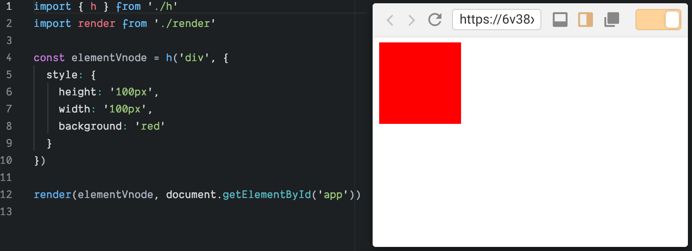
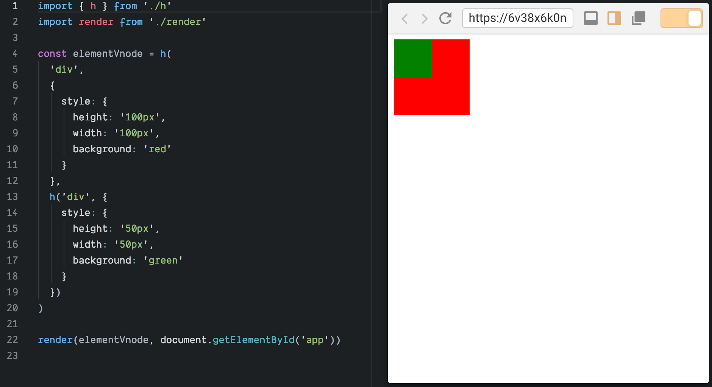
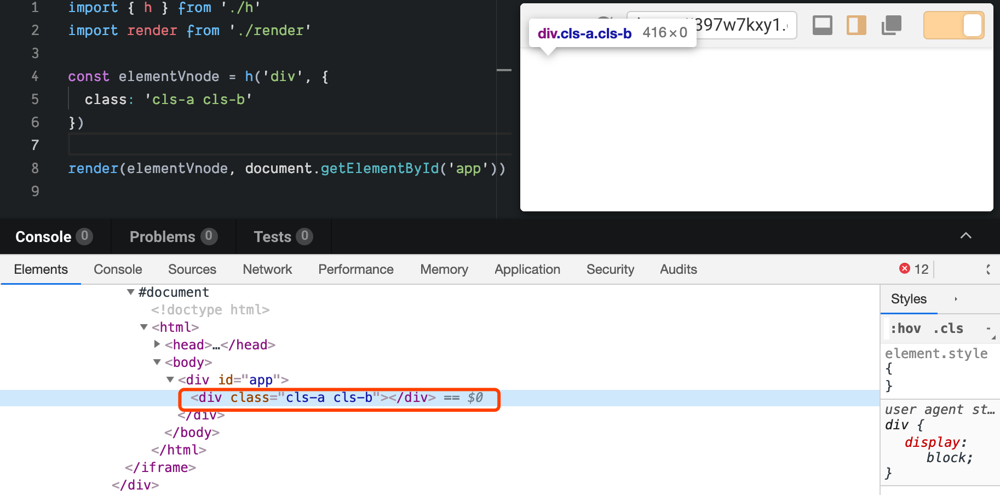
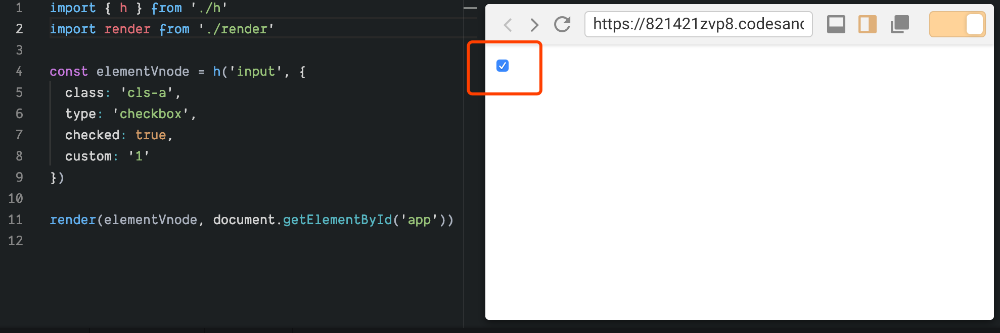
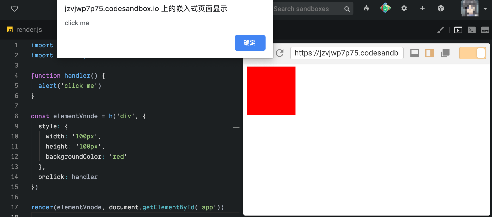
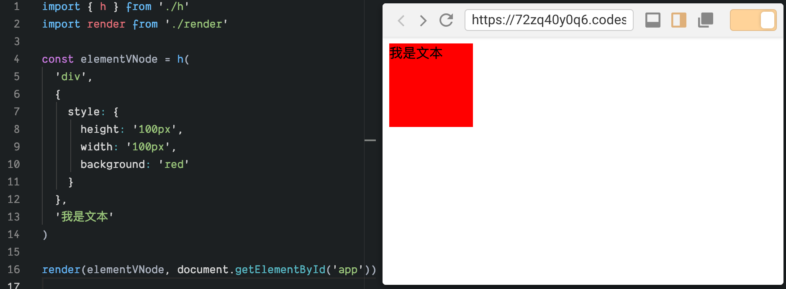
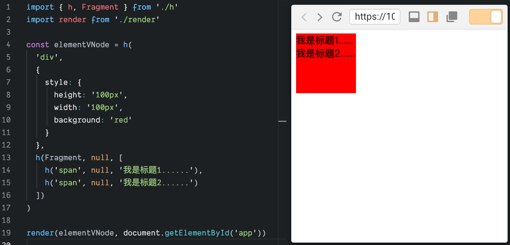
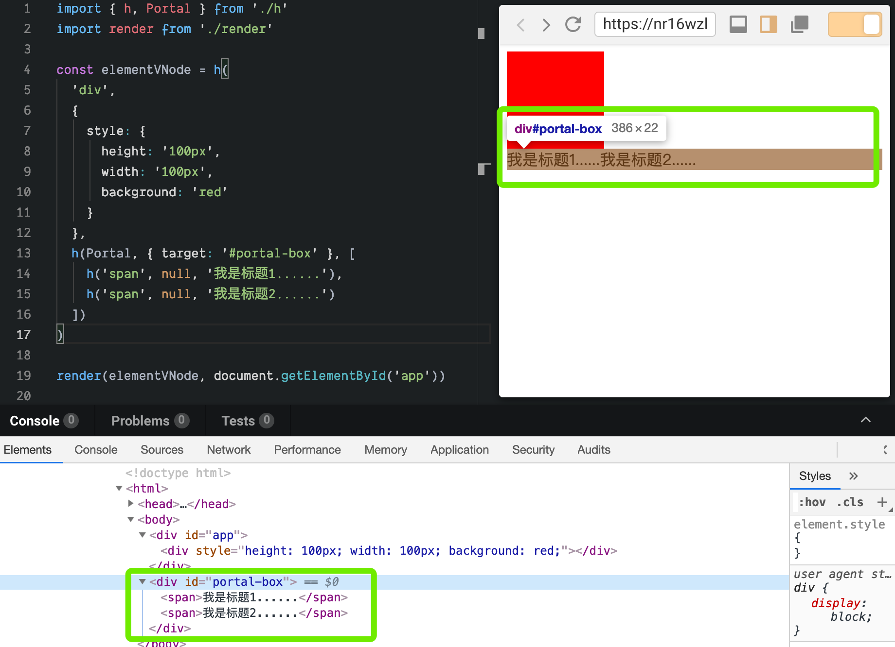
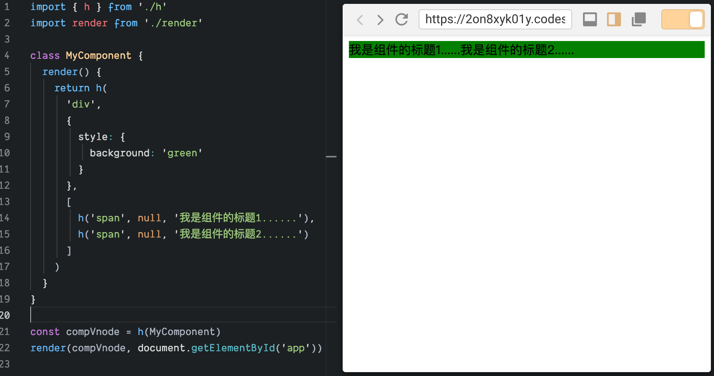
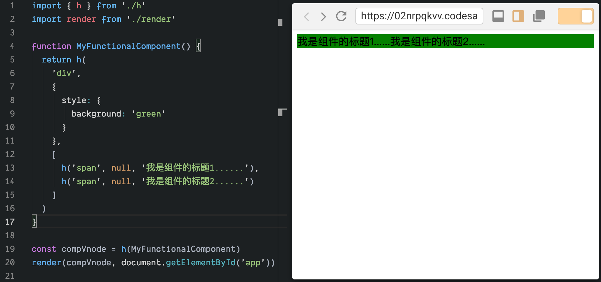

# 渲染器之挂载

:::tip
本章主要讲解渲染器将各种类型的 `VNode` 挂载为真实 DOM 的原理，阅读本章内容你将对 `Fragment` 和 `Portal` 有更加深入的理解，同时渲染器对有状态组件和函数式组件的挂载实际上也透露了有状态组件和函数式组件的实现原理，这都会包含在本章的内容之中。另外本章的代码将使用上一章所编写的 `h` 函数，所以请确保你已经阅读了上一章的内容。
:::

## 责任重大的渲染器

所谓渲染器，简单的说就是将 `Virtual DOM` 渲染成特定平台下真实 `DOM` 的工具(就是一个函数，通常叫 `render`)，渲染器的工作流程分为两个阶段：`mount` 和 `patch`，如果旧的 `VNode` 存在，则会使用新的 `VNode` 与旧的 `VNode` 进行对比，试图以最小的资源开销完成 `DOM` 的更新，这个过程就叫 `patch`，或“打补丁”。如果旧的 `VNode` 不存在，则直接将新的 `VNode` 挂载成全新的 `DOM`，这个过程叫做 `mount`。

通常渲染器接收两个参数，第一个参数是将要被渲染的 `VNode` 对象，第二个参数是一个用来承载内容的容器(`container`)，通常也叫挂载点，如下代码所示：

```js {6,13,18}
function render(vnode, container) {
  const prevVNode = container.vnode
  if (prevVNode == null) {
    if (vnode) {
      // 没有旧的 VNode，只有新的 VNode。使用 `mount` 函数挂载全新的 VNode
      mount(vnode, container)
      // 将新的 VNode 添加到 container.vnode 属性下，这样下一次渲染时旧的 VNode 就存在了
      container.vnode = vnode
    }
  } else {
    if (vnode) {
      // 有旧的 VNode，也有新的 VNode。则调用 `patch` 函数打补丁
      patch(prevVNode, vnode, container)
      // 更新 container.vnode
      container.vnode = vnode
    } else {
      // 有旧的 VNode 但是没有新的 VNode，这说明应该移除 DOM，在浏览器中可以使用 removeChild 函数。
      container.removeChild(prevVNode.el)
      container.vnode = null
    }
  }
}
```

整体思路非常简单，如果旧的 `VNode` 不存在且新的 `VNode` 存在，那就直接挂载(`mount`)新的 `VNode` ；如果旧的 `VNode` 存在且新的 `VNode` 不存在，那就直接将 `DOM` 移除；如果新旧 `VNode` 都存在，那就打补丁(`patch`)：

| 旧 VNode      | 新 VNode | 操作 |
| ----------- | ----------- | ----------- |
| ❌      | ✅       | 调用 `mount` 函数 |
| ✅      | ❌       | 移除 `DOM` |
| ✅      | ✅       | 调用 `patch` 函数 |

之所以说渲染器的责任非常之大，是因为它不仅仅是一个把 `VNode` 渲染成真实 `DOM` 的工具，它还负责以下工作：

- 控制部分组件生命周期钩子的调用

在整个渲染周期中包含了大量的 `DOM` 操作、组件的挂载、卸载，控制着组件的生命周期钩子调用的时机。

- 多端渲染的桥梁

渲染器也是多端渲染的桥梁，自定义渲染器的本质就是把特定平台操作“DOM”的方法从核心算法中抽离，并提供可配置的方案。

- 与异步渲染有直接关系

`Vue3` 的异步渲染是基于调度器的实现，若要实现异步渲染，组件的挂载就不能同步进行，DOM的变更就要在合适的时机，一些需要在真实DOM存在之后才能执行的操作(如 `ref`)也应该在合适的时机进行。对于时机的控制是由调度器来完成的，但类似于组件的挂载与卸载以及操作 `DOM` 等行为的入队还是由渲染器来完成的，这也是为什么 `Vue2` 无法轻易实现异步渲染的原因。

- 包含最核心的 Diff 算法

`Diff` 算法是渲染器的核心特性之一，可以说正是 `Diff` 算法的存在才使得 `Virtual DOM` 如此成功。

## 挂载普通标签元素

### 基本原理

渲染器的责任重大，所以它做的事情也非常多，一口吃成胖子是不太现实的，我们需要一点点地消化。

在初次调用渲染器渲染某个 `VNode` 时：

```js
const vnode = {/*...*/}
render(vnode, container)
```

由于没有旧的 `VNode` 存在，所以会调用 `mount` 函数挂载全新的 `VNode` ，这个小节我们就探讨一下渲染器的 `mount` 函数是如何把 `VNode` 渲染成真实 `DOM` 的，以及其中一些核心的关键点。

`mount` 函数的作用是把一个 `VNode` 渲染成真实 `DOM`，根据不同类型的 `VNode` 需要采用不同的挂载方式，如下：

```js
function mount(vnode, container) {
  const { flags } = vnode
  if (flags & VNodeFlags.ELEMENT) {
    // 挂载普通标签
    mountElement(vnode, container)
  } else if (flags & VNodeFlags.COMPONENT) {
    // 挂载组件
    mountComponent(vnode, container)
  } else if (flags & VNodeFlags.TEXT) {
    // 挂载纯文本
    mountText(vnode, container)
  } else if (flags & VNodeFlags.FRAGMENT) {
    // 挂载 Fragment
    mountFragment(vnode, container)
  } else if (flags & VNodeFlags.PORTAL) {
    // 挂载 Portal
    mountPortal(vnode, container)
  }
}
```

我们根据 `VNode` 的 `flags` 属性值能够区分一个 `VNode` 对象的类型，不同类型的 `VNode` 采用不同的挂载函数：


我们首先来讨论一下 `mountElement` 函数，它用于挂载普通标签元素。我们在"组件的本质"一章中曾经编写过如下这段代码：

```js
function mountElement(vnode, container) {
  const el = document.createElement(vnode.tag)
  container.appendChild(el)
}
```

这是一个极简的用于挂载普通标签元素的 `mountElement` 函数，它会调用浏览器提供的 `document.createElement` 函数创建元素，接着调用 `appendChild` 函数将元素添加到 `container` 中，但它具有以下缺陷：

- 1、`VNode` 被渲染为真实DOM之后，没有引用真实DOM元素
- 2、没有将 `VNodeData` 应用到真实DOM元素上
- 3、没有继续挂载子节点，即 `children`
- 4、不能严谨地处理 `SVG` 标签

针对这四个问题，我们逐个去解决。先来看第一个问题：**`VNode` 被渲染为真实DOM之后，没有引用真实DOM元素**，这个问题很好解决，只需要添加一行代码即可：

```js {3}
function mountElement(vnode, container) {
  const el = document.createElement(vnode.tag)
  vnode.el = el
  container.appendChild(el)
}
```

再来看第二个问题：**没有将 `VNodeData` 应用到元素上**，我们知道 `VNodeData` 作为 `VNode` 的描述，对于标签元素来说它包含了元素的样式、事件等诸多信息，我们需要将这些信息应用到新创建的真实DOM元素上，假设我们有如下 `VNode`：

:::tip
再次强调，本章使用上一章节中所编写的 `h` 函数。
:::

```js
const elementVnode = h(
  'div',
  {
    style: {
      height: '100px',
      width: '100px',
      background: 'red'
    }
  }
)
```

我们使用 `h` 函数创建了一个描述 `div` 标签的 `VNode` 对象，观察 `VNodeData` 可以发现，它拥有一些内联样式，所以在 `mountElement` 函数内，我们需要将这些内联样式应用到元素上，我们给 `mountElement` 增加如下代码：

```js {4-19}
function mountElement(vnode, container) {
  const el = document.createElement(vnode.tag)

  // 拿到 VNodeData
  const data = vnode.data
  if (data) {
    // 如果 VNodeData 存在，则遍历之
    for(let key in data) {
      // key 可能是 class、style、on 等等
      switch(key) {
        case 'style':
          // 如果 key 的值是 style，说明是内联样式，逐个将样式规则应用到 el
          for(let k in data.style) {
            el.style[k] = data.style[k]
          }
        break
      }
    }
  }

  container.appendChild(el)
}
```

如上代码所示，在创建真实DOM之后，我们需要检查 `VNodeData` 是否存在，如果 `VNodeData` 存在则遍历之。由于 `VNodeData` 中不仅仅包含内联样式的描述(即 `style`)，还可能包含其他描述如 `class`、事件等等，所以我们使用 `switch...case` 语句对不同的 `key` 值做区分处理，以 `style` 为例，我们只需要将 `data.style` 中的样式规则应用到真实DOM即可。使用渲染器渲染 `elementVNode` 的效果如下：



对于 `class` 或事件或其他DOM属性都是类似的处理方式，为了不偏题我们放到后面统一讲解，接下来我们来看第三个问题：**没有继续挂载子节点，即 `children`**，我们知道 `VNode` 是有可能存在子节点的，现在的 `mountElement` 函数仅仅将该 `VNode` 本身所描述的DOM元素添加到了页面中，却没有理会其子节点，为了递归地挂载子节点，我们需要为 `mountElement` 函数增加如下代码：

```js {6-11}
function mountElement(vnode, container) {
  const el = document.createElement(vnode.tag)
  vnode.el = el
  // 省略处理 VNodeData 相关的代码

  // 递归挂载子节点
  if (vnode.children) {
    for (let i = 0; i < vnode.children.length; i++) {
      mountElement(vnode.children[i], el)
    }
  }

  container.appendChild(el)
}
```

观察如上代码中用来递归挂载子节点的代码，我们默认把 `vnode.children` 当作数组来处理，同时递归挂载的时候调用的仍然是 `mountElement` 函数。这存在两个瑕疵，第一个瑕疵是 `VNode` 对象的 `children` 属性不总是数组，因为当 `VNode` 只有一个子节点时，该 `VNode` 的 `children` 属性直接指向该子节点，且 `VNode` 的 `childFlags` 的值为 `ChildrenFlags.SINGLE_VNODE`，所以我们不应该总是使用 `for` 循环遍历 `vnode.children`。第二个瑕疵是我们在 `for` 循环内部直接调用了 `mountElement` 属性去挂载每一个 `children` 中的 `VNode` 对象，但问题是 `children` 中的 `VNode` 对象可能是任意类型的，所以我们不应该直接调用 `mountElement` 函数，而是应该调用 `mount` 函数。更加严谨的代码如下：

```js {6-19}
function mountElement(vnode, container) {
  const el = document.createElement(vnode.tag)
  vnode.el = el
  // 省略处理 VNodeData 的代码

  // 拿到 children 和 childFlags
  const childFlags = vnode.childFlags
  const children = vnode.children
  // 检测如果没有子节点则无需递归挂载
  if (childFlags !== ChildrenFlags.NO_CHILDREN) {
    if (childFlags & ChildrenFlags.SINGLE_VNODE) {
      // 如果是单个子节点则调用 mount 函数挂载
      mount(children, el)
    } else if (childFlags & ChildrenFlags.MULTIPLE_VNODES) {
      // 如果是单多个子节点则遍历并调用 mount 函数挂载
      for (let i = 0; i < children.length; i++) {
        mount(children[i], el)
      }
    }
  }

  container.appendChild(el)
}
```

如上代码所示，我们通过 `vnode.childFlags` 拿到该 `VNode` 子节点的类型，接着检测其是否含有子节点，如果存在子节点，会检测是单个子节点还是多个子节点，只有当存在多个子节点时其 `children` 属性才是可遍历的数组，最后调用 `mount` 函数挂载之。

我们尝试修改之前的 `elementVNode`，为其添加子节点：

```js {10-16}
const elementVnode = h(
  'div',
  {
    style: {
      height: '100px',
      width: '100px',
      background: 'red'
    }
  },
  h('div', {
    style: {
      height: '50px',
      width: '50px',
      background: 'green'
    }
  })
)
```

如上代码可知，我们为 `elementVnode` 添加了一个子节点，该子节点是一个边长为 `50px` 的绿色正方形，使用渲染器渲染修改后的 `elementVnode` 的效果如下：



接着我们来看最后一个问题：**不能严谨地处理 `SVG` 标签**，在之前的 `mountElement` 函数中我们使用 `document.createElement` 函数创建DOM元素，但是对于 `SVG` 标签，更加严谨的方式是使用 `document.createElementNS` 函数，修改 `mountElement` 如下：

```js {2-5}
function mountElement(vnode, container) {
  const isSVG = vnode.flags & VNodeFlags.ELEMENT_SVG
  const el = isSVG
    ? document.createElementNS('http://www.w3.org/2000/svg', vnode.tag)
    : document.createElement(vnode.tag)
  vnode.el = el
  // 省略...
}
```

我们通过 `vnode.flags` 来判断一个标签是否是 `SVG`，但是大家不要忘记 `vnode.flags` 是如何被标记为 `VNodeFlags.ELEMENT_SVG`的，我们在讲解 `h` 函数时说明过这个问题，如下代码所示：

```js {4}
function h(tag, data, children) {
  let flags = null
  if (typeof tag === 'string') {
    flags = tag === 'svg' ? VNodeFlags.ELEMENT_SVG : VNodeFlags.ELEMENT_HTML
  }
}
```

我们注意到，只有当标签名字全等于字符串 `'svg'` 时，该 `VNode` 的 `flags` 才会被标记为 `VNodeFlags.ELEMENT_SVG`，这意味着 `<circle/>` 标签不会被标记为 `VNodeFlags.ELEMENT_SVG`，所以在创建 `<circle/>` 元素时并不会使用 `document.createElementNS` 函数，但 `<circle/>` 标签确实是 `svg` 标签，如何解决这个问题呢？其实很简单，因为 **`svg` 的书写总是以 `<svg>` 标签开始的，所有其他 `svg` 相关的标签都是 `<svg>` 标签的子代元素**。所以解决方案就是：在 `mountElement` 函数中一旦 `isSVG` 为真，那么后续创建的所有子代元素都会被认为是 `svg` 标签，我们需要修改 `mountElement` 函数，为其添加第三个参数，如下：

```js {1,2,11-12,15-16}
function mountElement(vnode, container, isSVG) {
  isSVG = isSVG || vnode.flags & VNodeFlags.ELEMENT_SVG
  const el = isSVG
    ? document.createElementNS('http://www.w3.org/2000/svg', vnode.tag)
    : document.createElement(vnode.tag)
  // 省略处理 VNodeData 的代码

  const childFlags = vnode.childFlags
  if (childFlags !== ChildrenFlags.NO_CHILDREN) {
    if (childFlags & ChildrenFlags.SINGLE_VNODE) {
      // 这里需要把 isSVG 传递下去
      mount(children, el, isSVG)
    } else if (childFlags & ChildrenFlags.MULTIPLE_VNODES) {
      for (let i = 0; i < children.length; i++) {
        // 这里需要把 isSVG 传递下去
        mount(children[i], el, isSVG)
      }
    }
  }

  container.appendChild(el)
}
```

如上代码所示，我们为 `mountElement` 增加了第三个参数 `isSVG`，接着在判断一个 `VNode` 是否是 `svg` 元素时优先使用参数中的 `isSVG` 作为判断条件，并且使用 `vnode.flags & VNodeFlags.ELEMENT_SVG` 作为回退判断条件，最后在挂载子节点的时候将 `isSVG` 参数传递下去。这样我们就能达到一个目的：**即使 `<circle/>` 标签对应的 `vnode.flags` 不是 `VNodeFlags.ELEMENT_SVG`，但在 `mountElement` 函数看来它依然是 `svg` 标签**。

:::tip
实际上我们也应该对大部分挂载函数做一定的修改，即增加第三个参数，这里就省略了。完整可运行代码请查看：[https://codesandbox.io/s/6v38x6k0nw](https://codesandbox.io/s/6v38x6k0nw)
:::

### class的处理

前面我们在 `mountElement` 函数中实现了将内联样式应用到元素的功能，接着我们来想办法将 `class` 也应用到元素上，在开始实现功能之前我们第一步要做的是：**设计数据结构**，比如我们采用了 `data.style` 来存储内联样式的数据，并且其数据结构就是一个 `key-value` 的映射，对于 `class` 我们希望使用 `data.class` 来存储其数据，并且我们希望 `data.class` 的值就是类名字符串，例如：

```js {4}
const elementVnode = h(
  'div',
  {
    class: 'cls-a cls-b'
  }
)
```

这样我们就可以轻松将类名列表添加到DOM元素上，我们为 `mountElement` 添加如下代码：

```js {13-19}
function mountElement(vnode, container, isSVG) {
  // 省略...

  const data = vnode.data
  if (data) {
    for (let key in data) {
      switch (key) {
        case 'style':
          for (let k in data.style) {
            el.style[k] = data.style[k]
          }
          break
        case 'class':
          el.className = data[key]
          break
        default:
          break
      }
    }
  }

  // 省略...
}
```

如上高亮代码所示，我们给 `switch` 添加了一个 `case` 语句块，用来匹配 `VNodeData` 中的 `class` 数据，由于我们将 `data.class` 设计成了可直接使用的类名列表字符串，所以只需要直接将 `data.class` 赋值给 `el.className` 即可，如下是渲染 `elementVNode` 的效果：



效果已经达到了，但是我们需要额外思考一些东西。在上面的讲解中我们直接把 `data.class` 的数据结构设计成可直接使用的类名列表字符串，但这是很底层的设计，换句话说这是框架层面的设计，我们还需要考虑应用层的设计，什么意思呢？来看如下这段模板：

```html
<template>
  <div class="cls-a" :class="dynamicClass"></div>
</template>
```

在这段模板中我们同时使用了 `class` 属性和绑定的 `:class` 属性，对于非绑定的 `class` 属性来说它的值就是我们最终想要的类名列表字符串，但是对于绑定的 `:class` 属性来说它的值是动态的 `javascript` 值，所以我们需要设计一下哪些值是被允许的。

首先数组应该是被允许的：

```js
dynamicClass = ['class-b', 'class-c']
```

对象也应该是被允许的：

```js
dynamicClass = {
  'class-b': true,
  'class-c': true
}
```

在编译器对模板进行编译时，我们把非绑定和绑定的 `class` 属性值合并，如下是我们期望编译器对上面模板的编译结果：

```js
h('div', {
  class: ['class-a', dynamicClass]
})
```

如果 `dynamicClass` 是数组，那么如上代码等价于：

```js
h('div', {
  class: ['class-a', ['class-b', 'class-c']]
})
```

如果 `dynamicClass` 是对象，那么编译的结果等价于：

```js
h('div', {
  class: [
    'class-a',
    {
      'class-b': true,
      'class-c': true
    }
  ]
})
```

可以看到在使用 `h` 函数创建 `VNode` 时，`VNodeData` 中的 `class` 还不可能是我们最终想要的类名列表字符串，那怎么办呢？很简单，我们只需要在 `h` 函数内部编写一个函数将如上数据结构序列化成我们想要的类名列表字符串就可以了，这就像一个小小的算法题目，相信大家都写的出来，这里就不展开讲解，下面的链接中拥有完整的可执行代码。

:::tip
完整代码&在线体验地址：[https://codesandbox.io/s/397w7kxy1](https://codesandbox.io/s/397w7kxy1)
:::

实际上，通过对 `class` 的讲解，我们涉及了在框架设计中比较重要的概念：**应用层的设计**，这是框架设计的核心，在设计一个功能的时候，你首先要考虑的应该是应用层的使用，然后再考虑如何与底层衔接。还是以 `class` 为例，为一个标签元素设置类名的方法是可定的(调用 `el.className` 或 `setAttribute`)，关键就在于你想在应用层做出怎样的设计，很自然的你要思考如何转化应用层的数据结构与底层衔接。

### Attributes 和 DOM Properties

接下来我们讲一讲DOM的 `Attributes` 以及 `Properties`，下面我们分别简称他们为 `attr` 和 `DOM Prop`，那么他们两个之间有什么区别呢？这里我们简单解释一下，我们知道浏览器在加载页面之后会对页面中的标签进行解析，并生成与之相符的 DOM 对象，每个标签中都可能包含一些属性，如果这些属性是**标准属性**，那么解析生成的DOM对象中也会包含与之对应的属性，例如：

```html
<body id="page"></body>
```

由于 `id` 是标准属性，所以我们可以通过 `document.body.id` 来访问它的值，实际上我们常说的 `Attr` 指的就是那些存在于标签上的属性，而 `DOM Prop` 就是存在于DOM对象上的属性。但是当标签上存在非标准属性时，该属性不会被转化为 `DOM Prop`，例如：

```js
<body custom="val"></body>
```

由于 `custom` 是非标准属性，所以当你尝试通过 `document.body.custom` 访问其值时会得到 `undefined`，这也是为什么 `setAttribute` 方法存在的原因，因为该方法允许我们为 DOM 元素设置自定义属性（不会初始化同名的 `property`）。另外该方法也允许我们为 DOM 元素设置标准属性的值，所以我们可不可以总是使用 `setAttribute` 设置全部的 `DOM` 属性呢？答案是：不行。举个例子：

```js
// checkbox 元素
const checkboxEl = document.querySelector('input')
// 使用 setAttribute 设置 checked 属性为 false
checkboxEl.setAttribute('checked', false)

console.log(checkboxEl.checked) // true
```

可以看到虽然我们使用 `setAttribute` 函数将复选框的 `checked` 属性设置为 `false`，但是当我们访问 `checkboxEl.checked` 时得到的依然是 `true`，这是因为在 `setAttribute` 函数为元素设置属性时，无论你传递的值是什么类型，它都会将该值转为字符串再设置到元素上，所以如下两句代码是等价的：

```js
checkboxEl.setAttribute('checked', false)
// 等价于
checkboxEl.setAttribute('checked', 'false')
```

:::tip
一些特殊的 `attribute`，比如 `checked/disabled` 等，只要出现了，对应的 `property` 就会被初始化为 `true`，无论设置的值是什么,只有调用 `removeAttribute` 删除这个 `attribute`，对应的 `property` 才会变成 `false`。
:::

这就指引我们有些属性不能通过 `setAttribute` 设置，而是应该直接通过 DOM 元素设置：`el.checked = true`。好在这样的属性不多，我们可以列举出来：`value`、`checked`、`selected`、`muted`。除此之外还有一些属性也需要使用 `Property` 的方式设置到 DOM 元素上，例如 `innerHTML` 和 `textContent` 等等。

刚才我们讲解了为什么同样是写在标签上的属性，却要区分对待的原因，接下来我们进入正题，开始完成将属性应用到 DOM 元素上的实现，到目前为止，我们已经为 `VNodeData` 设计了三个属性，如下：

```js
{
  style: ..., // 内联样式数据
  class: ..., // class 数据
  target: ... // Portal 的挂载目标
}
```

接下来我们还会为 `VNodeData` 添加更多属性，用来存储标签的数据，如下 `input` 标签所示：

```html
<input class="cls-a" type="checkbox" checked custom="1"/>
```

它有四个属性，我们打算在 `VNodeData` 中存储其属性名以及数据：

```js
h('input', {
  class: 'cls-a',
  type: 'checkbox',
  checked: true,
  custom: '1'
})
```

如上代码所示，我们已经实现了关于 `class`、`style` 的处理，所以接下来我们要处理的就是 `VNodeData` 中除 `class` 和 `style` 之外的全部数据，当然也要排除 `VNodeData` 中的 `target` 属性，因为它只用于 `Portal`。处理方式很简单，我们为 `mountElement` 函数添加如下高亮代码：

```js {1,18-24}
const domPropsRE = /\[A-Z]|^(?:value|checked|selected|muted)$/
function mountElement(vnode, container, isSVG) {
  // 省略...

  const data = vnode.data
  if (data) {
    for (let key in data) {
      switch (key) {
        case 'style':
          for (let k in data.style) {
            el.style[k] = data.style[k]
          }
          break
        case 'class':
          el.className = data[key]
          break
        default:
          if (domPropsRE.test(key)) {
            // 当作 DOM Prop 处理
            el[key] = data[key]
          } else {
            // 当作 Attr 处理
            el.setAttribute(key, data[key])
          }
          break
      }
    }
  }

  // 省略...
}
```

如上高亮代码所示，我们首先创建了一个正则表达式 `domPropsRE`，用来检测那些应该以 `Property` 的方式添加到 DOM 元素上的属性，其他的属性使用 `setAttribute` 方法设置。另外我们注意到正则 `domPropsRE` 除了用来匹配我们前面说过的固定的几个属性之外，它还能匹配那些拥有大写字母的属性，这是为了匹配诸如 `innerHTML`、`textContent` 等属性设计的，同时这也顺便实现了一个特性，即拥有大写字母的属性我们都会采用 `el[key] = xxx` 的方式将其添加到 DOM 元素上。

如下是渲染上面 `input` 标签的效果图：



:::tip
完整代码&在线体验地址：[https://codesandbox.io/s/821421zvp8](https://codesandbox.io/s/821421zvp8)
:::

### 事件的处理

现在我们只剩下为 DOM 元素添加事件了，实际上在 `mount` 阶段为 DOM 元素添加事件很容易，我们只需要在元素对象上调用 `addEventListener` 方法即可，关键在于我们的 `VNodeData` 要如何设计。

通常我们给元素添加事件的规则是**使用 `v-on` 或 `@` 符号加上事件名字**，例如给元素添加点击事件：

```html
<div @click="handler"></div>
```

当然事件名字中不包含 `'on'` 前缀，即 `click` 而不是 `onclick`，我们可以用如下 `VNode` 对象来描述如上模板：

```js
const elementVNode = h('div', {
  click: handler
})
```

然而这么做是有问题的，如上代码所示 `elementVNode` 的 `VNodeData` 中的 `click` 属性没办法与其他DOM属性区分，所以渲染器并不知道 `click` 属性代表的是事件，当然我们可以做出规定，例如我们规定 `VNodeData` 中的 `click` 属性是个特殊的属性，它用来存储事件回调函数，但这是很笨的方法，因为 DOM 原生事件很多，这种方案需要我们一一列举所有 DOM 事件并且扩展性很差。所以我们需要考虑如何将事件与属性区分，其实我们就沿用原生 DOM 对象的设计即可，在原生 DOM 对象中所有事件函数的名字都是 `'on' + 事件名称` 的形式，所以我们可以在 `VNodeData` 中使用 `onclick` 代替 `click`：

```js
const elementVNode = h('div', {
  onclick: handler
})
```

当然从模板到 `VNodeData` 的这个变化是由编译器来做的，这样设计之后我们就可以很容易地区分 `VNodeData` 中的某个属性是 DOM 属性还是 DOM 事件：**只需要检测属性名的前两个字符是不是 `'on'` 即可**。

在区分出事件之后，我们就可以着手将事件添加到 DOM 元素上了，只需调用 `el.addEventListener` 方法即可，如下：

```js {21-23}
function mountElement(vnode, container, isSVG) {
  // 省略...

  const data = vnode.data
  if (data) {
    for (let key in data) {
      switch (key) {
        case 'style':
          for (let k in data.style) {
            el.style[k] = data.style[k]
          }
          break
        case 'class':
          if (isSVG) {
            el.setAttribute('class', data[key])
          } else {
            el.className = data[key]
          }
          break
        default:
          if (key[0] === 'o' && key[1] === 'n') {
            // 事件
            el.addEventListener(key.slice(2), data[key])
          } else if (domPropsRE.test(key)) {
            // 当作 DOM Prop 处理
            el[key] = data[key]
          } else {
            // 当作 Attr 处理
            el.setAttribute(key, data[key])
          }
          break
      }
    }
  }

  // 省略...
}
```

如上高亮代码所示，我们通过检查 `VNodeData` 对象的键名(`key`)的前两个字符是否是 `'on'`，来区分其是否是事件，如果是事件则调用 `el.addEventListener` 将事件回调函数添加到元素上。

我们可以测试一下我们的代码：

```js
// 事件回调函数
function handler() {
  alert('click me')
}

// VNode
const elementVnode = h('div', {
  style: {
    width: '100px',
    height: '100px',
    backgroundColor: 'red'
  },
  // 点击事件
  onclick: handler
})

render(elementVnode, document.getElementById('app'))
```

其效果如下，当点击红色方块时会触发点击事件执行回调函数：



:::tip
完整代码&在线体验地址：[https://codesandbox.io/s/jzvjwp7p75](https://codesandbox.io/s/jzvjwp7p75)
:::

需要强调的是，在 `mount` 阶段我们没有考虑事件更新的情况，我们会在讲解 `patch` 阶段的内容时说明。

## 挂载纯文本、Fragment 和 Portal

### 挂载文本节点

如果一个 `VNode` 的类型是 `VNodeFlags.TEXT`，那么 `mount` 函数会调用 `mountText` 函数挂载该纯文本元素：

```js {9-11}
function mount(vnode, container, isSVG) {
  const { flags } = vnode
  if (flags & VNodeFlags.ELEMENT) {
    // 挂载普通标签
    mountElement(vnode, container, isSVG)
  } else if (flags & VNodeFlags.COMPONENT) {
    // 挂载组件
    mountComponent(vnode, container, isSVG)
  } else if (flags & VNodeFlags.TEXT) {
    // 挂载纯文本
    mountText(vnode, container)
  } else if (flags & VNodeFlags.FRAGMENT) {
    // 挂载 Fragment
    mountFragment(vnode, container, isSVG)
  } else if (flags & VNodeFlags.PORTAL) {
    // 挂载 Portal
    mountPortal(vnode, container)
  }
}
```

`mountText` 函数实现起来很简单，由于纯文本类型的 `VNode` 其 `children` 属性存储着与之相符的文本字符串，所以只需要调用 `document.createTextNode` 函数创建一个文本节点即可，然后将其添加到 `container` 中，如下：

```js
function mountText(vnode, container) {
  const el = document.createTextNode(vnode.children)
  vnode.el = el
  container.appendChild(el)
}
```

我们修改一下之前的 `elementVNode`，为其添加一个文本子节点：

```js {10}
const elementVNode = h(
  'div',
  {
    style: {
      height: '100px',
      width: '100px',
      background: 'red'
    }
  },
  '我是文本'
)
```

使用渲染器渲染如上 `elementVnode` 的结果如下图所示：



:::tip
完整代码&在线体验地址：[https://codesandbox.io/s/72zq40y0q6](https://codesandbox.io/s/72zq40y0q6)
:::

### 挂载 Fragment

其实挂载 `Fragment` 和单纯地挂载一个 `VNode` 的 `children` 是没什么区别的，在没有 `Fragment` 时我们要想挂载一个片段，这个片段必须使用包裹元素包裹，如下：

```html
<!-- div 就是包裹元素 -->
<div>
  <h1></h1>
  <p></p>
</div>
```

有了 `Fragment` 则不需要包裹元素：

```html
<Fragment>
  <h1></h1>
  <p></p>
</Fragment>
```

这两段代码的区别是：`<Fragment>` 标签不会被渲染为真实DOM，也就不会产生多余的DOM元素，再来观察一下这两个模板片段对应的 `VNode`：

- 没有 `Fragment`：

```js {2,3}
const elementVNode = {
  flags: VNodeFlags.ELEMENT_HTML,
  tag: "div",
  data: null,
  childFlags: ChildrenFlags.MULTIPLE_VNODES,
  children: [
    {
      flags: VNodeFlags.ELEMENT_HTML,
      tag: 'h1',
      data: null,
      childFlags: ChildrenFlags.NO_CHILDREN,
      children: null,
      el: null
    },
    {
      flags: VNodeFlags.ELEMENT_HTML,
      tag: 'p',
      data: null
      childFlags: ChildrenFlags.NO_CHILDREN,
      children: null,
      el: null
    }
  ],
  el: null
}
```

- 有 `Fragment`：

```js {2,3}
const elementVNode = {
  flags: VNodeFlags.FRAGMENT,
  tag: null,
  data: null,
  childFlags: ChildrenFlags.MULTIPLE_VNODES,
  children: [
    {
      flags: VNodeFlags.ELEMENT_HTML,
      tag: 'h1',
      data: null,
      childFlags: ChildrenFlags.NO_CHILDREN,
      children: null,
      el: null
    },
    {
      flags: VNodeFlags.ELEMENT_HTML,
      tag: 'p',
      data: null
      childFlags: ChildrenFlags.NO_CHILDREN,
      children: null,
      el: null
    }
  ],
  el: null
}
```

通过对比可以很容易地发现，使用包裹元素的模板与 `Fragment` 唯一的区别就是 `elementVNode.flags` 和 `elementVNode.tag` 的不同。在 `mount` 函数内部，如果一个 `VNode` 的类型是 `Fragment` (即 `VNodeFlags.FRAGMENT`)，则会使用 `mountFragment` 函数进行挂载，实际上对于 `Fragment` 类型的 `VNode` 的挂载，就等价于只挂载一个 `VNode` 的 `children`，仅此而已，实现如下：

```js
function mountFragment(vnode, container, isSVG) {
  // 拿到 children 和 childFlags
  const { children, childFlags } = vnode
  switch (childFlags) {
    case ChildrenFlags.SINGLE_VNODE:
      // 如果是单个子节点，则直接调用 mount
      mount(children, container, isSVG)
      break
    case ChildrenFlags.NO_CHILDREN:
      // 如果没有子节点，等价于挂载空片段，会创建一个空的文本节点占位
      const placeholder = createTextVNode('')
      mountText(placeholder, container)
      break
    default:
      // 多个子节点，遍历挂载之
      for (let i = 0; i < children.length; i++) {
        mount(children[i], container, isSVG)
      }
  }
}
```

逻辑非常简单，既然只需要挂载 `children`，那么就必须拿到 `children` 才行，顺便拿到 `children` 的类型 `childFlags`，然后根据不同的类型采用不同的挂载方式，其本质就是递归地调用 `mount` 函数进行挂载。

我们可以修改 `elementVnode`，让它的子节点是一个 `Fragment`。 如下：

```js {10-13}
const elementVNode = h(
  'div',
  {
    style: {
      height: '100px',
      width: '100px',
      background: 'red'
    }
  },
  h(Fragment, null, [
    h('span', null, '我是标题1......'),
    h('span', null, '我是标题2......')
  ])
)
```

最终的渲染效果如下图所示：



另外对于 `Fragment` 类型的 `VNode` 来说，当它被渲染为真实DOM之后，其 `el` 属性的引用是谁呢？这需要根据片段中节点的数量来决定，如果只有一个节点，那么 `el` 属性就指向该节点；如果有多个节点，则 `el` 属性值是第一个节点的引用；如果片段中没有节点，即空片段，则 `el` 属性引用的是占位的空文本节点元素，所以我们需要为 `mountFragment` 函数增加三句代码，如下：

```js {7,13,20}
function mountFragment(vnode, container, isSVG) {
  const { children, childFlags } = vnode
  switch (childFlags) {
    case ChildrenFlags.SINGLE_VNODE:
      mount(children, container, isSVG)
      // 单个子节点，就指向该节点
      vnode.el = children.el
      break
    case ChildrenFlags.NO_CHILDREN:
      const placeholder = createTextVNode('')
      mountText(placeholder, container)
      // 没有子节点指向占位的空文本节点
      vnode.el = placeholder.el
      break
    default:
      for (let i = 0; i < children.length; i++) {
        mount(children[i], container, isSVG)
      }
      // 多个子节点，指向第一个子节点
      vnode.el = children[0].el
  }
}
```

那么这样设计有什么意义呢？这是因为在 `patch` 阶段对DOM元素进行移动时，应该确保将其放到正确的位置，而不应该始终使用 `appendChild` 函数，有时需要使用 `insertBefore` 函数，这时候我们就需要拿到相应的节点引用，这时候 `vnode.el` 属性是必不可少的，就像上面的代码中即使 `Fragment` 没有子节点我们依然需要一个占位的空文本节点作为位置的引用。

:::tip
完整代码&在线体验地址：[https://codesandbox.io/s/109r8nlwk4](https://codesandbox.io/s/109r8nlwk4)
:::

### 挂载 Portal

实际上 `Portal` 可以不严谨地认为是**可以被到处挂载的 `Fragment`**。类型为 `Fragment` 的 `VNode` 其 `tag` 属性值为 `null`，而类型是 `Portal` 的 `VNode` 其 `tag` 属性值为挂载点(选择器或真实DOM元素)。实现 `Portal` 的关键是要将其 `VNode` 的 `children` 中所包含的子 `VNode` 挂载到 `tag` 属性所指向的挂载点，`mountPortal` 函数的实现如下：

```js {4-5,8-9,12-13}
function mountPortal(vnode, container) {
  const { tag, children, childFlags } = vnode

  // 获取挂载点
  const target = typeof tag === 'string' ? document.querySelector(tag) : tag

  if (childFlags & ChildrenFlags.SINGLE_VNODE) {
    // 将 children 挂载到 target 上，而非 container
    mount(children, target)
  } else if (childFlags & ChildrenFlags.MULTIPLE_VNODES) {
    for (let i = 0; i < children.length; i++) {
      // 将 children 挂载到 target 上，而非 container
      mount(children[i], target)
    }
  }
}
```

如上代码所示，挂载 `Portal` 的关键是我们需要通过 `vnode.tag` 获取到真正的挂载点，也就是 `target`，真正挂载时使用此挂载点代替 `container` 即可。

那么对于 `Portal` 类型的 `VNode` 其 `el` 属性应该指向谁呢？应该指向挂载点元素吗？实际上虽然 `Portal` 所描述的内容可以被挂载到任何位置，但仍然需要一个占位元素，并且 `Portal` 类型的 `VNode` 其 `el` 属性应该指向该占位元素，为什么这么设计呢？这是因为 `Portal` 的另外一个特性：**虽然 `Portal` 的内容可以被渲染到任意位置，但它的行为仍然像普通的DOM元素一样，如事件的捕获/冒泡机制仍然按照代码所编写的DOM结构实施**。要实现这个功能就必须需要一个占位的DOM元素来承接事件。但目前来说，我们用一个空的文本节点占位即可，我们为 `mountPortal` 函数添加如下代码：

```js {12-17}
function mountPortal(vnode, container) {
  const { tag, children, childFlags } = vnode
  const target = typeof tag === 'string' ? document.querySelector(tag) : tag
  if (childFlags & ChildrenFlags.SINGLE_VNODE) {
    mount(children, target)
  } else if (childFlags & ChildrenFlags.MULTIPLE_VNODES) {
    for (let i = 0; i < children.length; i++) {
      mount(children[i], target)
    }
  }

  // 占位的空文本节点
  const placeholder = createTextVNode('')
  // 将该节点挂载到 container 中
  mountText(placeholder, container, null)
  // el 属性引用该节点
  vnode.el = placeholder.el
}
```

如上高亮代码所示，我们创建了一个空文本节点，并将它挂载到 `container` 下(**注意不是挂载到 `target` 下**)，最后让 `Portal` 类型的 `VNode` 节点的 `el` 属性引用该空文本节点。

为了测试我们的代码，我们修改 `elementVNode` 如下：

```js {10-13}
const elementVNode = h(
  'div',
  {
    style: {
      height: '100px',
      width: '100px',
      background: 'red'
    }
  },
  h(Portal, { target: '#portal-box' }, [
    h('span', null, '我是标题1......'),
    h('span', null, '我是标题2......')
  ])
)
```

使用渲染器渲染该 `elementVNode` 的效果图如下：



可以发现 `Portal` 的挂载点是 `#portal-box`，而非 `#app`。

:::tip
完整代码&在线体验地址：[https://codesandbox.io/s/nr16wzln8m](https://codesandbox.io/s/nr16wzln8m)
:::

## 有状态组件的挂载和原理

我们在“组件的本质”一章中讲到过：**组件的产出是 `VNode`**，当时我们也大致实现了有状态组件的挂载，其思路是**拿到组件产出的 `VNode`，并将之挂载到正确的 `container` 中**，思路很简单，我们着手实现。

回顾一下我们的 `mount` 函数，如下高亮代码所示：

```js {6-8}
function mount(vnode, container, isSVG) {
  const { flags } = vnode
  if (flags & VNodeFlags.ELEMENT) {
    // 挂载普通标签
    mountElement(vnode, container, isSVG)
  } else if (flags & VNodeFlags.COMPONENT) {
    // 挂载组件
    mountComponent(vnode, container, isSVG)
  } else if (flags & VNodeFlags.TEXT) {
    // 挂载纯文本
    mountText(vnode, container)
  } else if (flags & VNodeFlags.FRAGMENT) {
    // 挂载 Fragment
    mountFragment(vnode, container, isSVG)
  } else if (flags & VNodeFlags.PORTAL) {
    // 挂载 Portal
    mountPortal(vnode, container, isSVG)
  }
}
```

当 `VNode` 的 `flags` 的值属于组件时(`VNodeFlags.COMPONENT`)，则会调用 `mountComponent` 函数挂载该 `VNode`，但是组件还分为有状态组件和函数式组件，所以在 `mountComponent` 函数内部，我们需要再次对组件的类型进行区分，并使用不同的挂载方式，如下是 `mountComponent` 函数的实现：

```js
function mountComponent(vnode, container, isSVG) {
  if (vnode.flags & VNodeFlags.COMPONENT_STATEFUL) {
    mountStatefulComponent(vnode, container, isSVG)
  } else {
    mountFunctionalComponent(vnode, container, isSVG)
  }
}
```

道理很简单，我们通过检查 `vnode.flags` 判断要挂载的 `VNode` 是否属于有状态组件(即 `VNodeFlags.COMPONENT_STATEFUL`)，如果该 `VNode` 描述的是有状态组件则调用 `mountStatefulComponent` 函数挂载，否则将该 `VNode` 当作函数式组件的描述，使用 `mountFunctionalComponent` 挂载。

挂载一个有状态组件只需要四步，如下是 `mountStatefulComponent` 函数的实现：

```js
function mountStatefulComponent(vnode, container, isSVG) {
  // 创建组件实例
  const instance = new vnode.tag()
  // 渲染VNode
  instance.$vnode = instance.render()
  // 挂载
  mount(instance.$vnode, container, isSVG)
  // el 属性值 和 组件实例的 $el 属性都引用组件的根DOM元素
  instance.$el = vnode.el = instance.$vnode.el
}
```

- 第一步：创建组件实例

如果一个 `VNode` 描述的是有状态组件，那么 `vnode.tag` 属性值就是组件类的引用，所以通过 `new` 关键字创建组件实例。

- 第二步：获取组件产出的 `VNode`

一个组件的核心就是其 `render` 函数，通过调用 `render` 函数可以拿到该组件要渲染的内容。

- 第三步：`mount` 挂载

既然已经拿到了 `VNode`，那么就将其挂载到 `container` 上就可以了。

- 第四步：让组件实例的 `$el` 属性和 `vnode.el` 属性的值引用组件的根DOM元素

组件的 `render` 函数会返回该组件产出的 `VNode`，当该 `VNode` 被挂载为真实DOM之后，就可以通过 `instance.$vnode.el` 元素拿到组件的根DOM元素，接着我们就可以让组件实例的 `$el` 属性和 `vnode.el` 属性的值都引用该DOM元素。如果组件的 `render` 返回的是一个片段(`Fragment`)，那么 `instance.$el` 和 `vnode.el` 引用的就是该片段的第一个DOM元素。

我们来测试一下我们的代码，假设我们要渲染的 `VNode` 如下：

```js
// h 函数的第一个参数是组件类
const compVnode = h(MyComponent)
render(compVnode, document.getElementById('app'))
```

如下是组件 `MyComponent` 组件的实现：

```js
class MyComponent {
  render() {
    return h(
      'div',
      {
        style: {
          background: 'green'
        }
      },
      [
        h('span', null, '我是组件的标题1......'),
        h('span', null, '我是组件的标题2......')
      ]
    )
  }
}
```

该组件的 `render` 函数返回了它要渲染的内容，如下是使用渲染器渲染后的效果：



:::tip
完整代码&在线体验地址：[https://codesandbox.io/s/2on8xyk01y](https://codesandbox.io/s/2on8xyk01y)
:::

这里再次强调一下，这就是**有状态组件的挂载原理**，仅此而已。有的同学可能会产生疑惑，比如这里没有体现生命周期呀，也没有体现 `data`、`props`、`ref` 或者 `slots` 等等，实际上我们早在“组件的本质”一章中就提到过**这些内容是在基本原理的基础上，再次设计的产物，它们为 `render` 函数生成 `VNode` 的过程中提供数据来源服务**，而**组件产出 `VNode` 才是永恒的核心**，所以本节我们重在讲解原理，至于 `data`、`props`、`ref` 等内容属于组件实例的设计，我们会在后续的章节中统一讲解。

## 函数式组件的挂载和原理

函数式组件就更加简单了，它就是一个返回 `VNode` 的函数：

```js
function MyFunctionalComponent() {
  // 返回要渲染的内容描述，即 VNode
  return h(
    'div',
    {
      style: {
        background: 'green'
      }
    },
    [
      h('span', null, '我是组件的标题1......'),
      h('span', null, '我是组件的标题2......')
    ]
  )
}
```

在挂载函数式组件的时候，比挂载有状态组件少了一个实例化的过程，如果一个 `VNode` 描述的是函数式组件，那么其 `tag` 属性值就是该函数的引用，如下：

如下是 `mountFunctionalComponent` 函数的实现：

```js
function mountFunctionalComponent(vnode, container, isSVG) {
  // 获取 VNode
  const $vnode = vnode.tag()
  // 挂载
  mount($vnode, container, isSVG)
  // el 元素引用该组件的根元素
  vnode.el = $vnode.el
}
```

我们来测试一下我们的代码：

```js
const compVnode = h(MyFunctionalComponent)
render(compVnode, document.getElementById('app'))
```

最终的渲染效果如下：



:::tip
完整代码&在线体验地址：[https://codesandbox.io/s/02nrpqkvv](https://codesandbox.io/s/02nrpqkvv)
:::

实际上如果对于 **有状态组件** 和 **函数式组件** 具体的区别不太了解的同学看到这里或许会产生疑问，觉得 **有状态组件** 的实例化很多余，实际上实例化是必须的，因为 **有状态组件** 在实例化的过程中会初始化一系列 **有状态组件** 所特有的东西，诸如 `data(或state)`、`computed`、`watch`、生命周期等等。而函数式组件只有 `props` 和 `slots`，它要做的工作很少，所以性能上会更好。具体的关于本地数据、`props` 数据，计算属性，插槽等的设计和实现，我们在后面的章节中统一讲解，这里给大家展示的就是最根本的原理。
